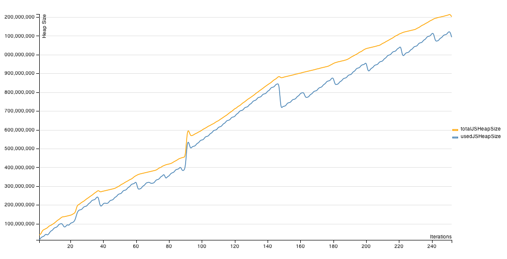

# sg-protractor-tools

[](https://travis-ci.org/SunGard-Labs/sg-protractor-tools)

Version: 1.0.1

This library provides a reusable and generic set of helper functions for the Protractor test framework, which SunGard is using for testing its HTML5-based user interfaces. It includes functions that simplify things like browser resizing, scrolling and memory usage tracking as part of a test suite. The project bundles an example application that showcases the functionality.

While using [Protractor](https://github.com/angular/protractor) for testing our [Angular](https://angularjs.org/)-based applications, we have found that we can simplify many of the common tasks done as part of part of our test suite. The Protractor API is fairly low-level in some cases, and we have seen that we can cut down the amount of code for some common tasks by externalizing functionality into a reusable library.

The [docs](docs) folder has more detailed information about the provided functionality, but here are some highlights:

## Functional Overview

### Memory Tracking

The library provides functionality for tracking your app's memory consumption as part of a Protractor test. When running multiple iterations of the same operation, this can be used to detect memory leaks in your application's code. To make things as easy as possible, we have encapsulated the required code in a simple function that allows you to focus on your test. The library takes care of running your test a configurable number of times, and it also takes care of tracking the memory usage. Once the test has been completed, you can use the generated CSV file to analyze the memory usage, and you can also get a quick overview by taking a look at the generated PNG diagram. Here's an example:



The above image shows an example diagram for a test case with 250 iterations. As you can see from the diagram, the used JS Heap size keeps increasing and is never reclaimed. Clearly someone hasn't been doing their homework, this is a pretty big memory leak!

Take a look at the [memory.md](docs/memory.md) file to see the API for running a test that's tracking memory consumption, and check out the [memory.spec](example/test/e2e/memory.spec) file for the library in action. The test code that you need to write is only a couple of lines:

```javascript
it('should increase the memory consumption', function () {
    var iterations = 250;

    sgpt.memory.runTestFunction(this, iterations, function () {
        // This test function will be called 250 times, and the memory is measured after each iteration.

        // Your test code goes here.
    });
}, 100000);
```

*Note: The memory tracking functionality only works in Google Chrome, when started with the `enable-precise-memory-info` and `js-flags=--expose-gc` flags. Other browsers currently don't expose a similar API. Take a look at the [example/protractor.conf.js](example/protractor.conf.js) file to see the required configuration.*

### Minor helper functions

In addition to the memory tracking, the library also includes functions that simplify common tasks like

* Resizing the browser window
* Scrolling to an element
* Drag and drop
* Waiting for DOM elements to become visible or hidden

## Setup

To include this library in your own project, use the following command:

```
npm install --save-dev sg-protractor-tools
```

This will include the library in your project's `package.json` file as a _development dependency_.

## Usage

To use the library in your code, use the following code to import it:

```
var sgpt = require('sg-protractor-tools');
```

This will expose the libraries main object as `sgpt` in your code. You can use the library's functions by referencing the `sgpt` object, e.g. for scrolling:

```
sgpt.scroll.scrollTo(...);
```

The library's functions are split up by their domain, e.g. all functions relating to resizing windows are grouped under the `sgpt.resize` object. Take a look at the [docs](docs) folder for more information.

## Examples

The [example](example) folder contains an example application with e2e tests that showcase how to use this library with Protractor.

The `README.md` file in the [example](example) folder lists all the tests that you can run, gives details about each one, as well as guidance on how to run them.

## Documentation

Detailed documentation on the library's functions can be found in the [docs](docs) folder.

## Contributing

This project uses Git-Flow as its development model. Any changes need to be made against the _develop_ branch.

Pull requests are welcome - please stick to the coding style used in the rest of the library. When adding/changing functionality, please provide/update the following:

* Documentation in the [docs](docs) folder.
* An example showcasing the new functionality in the [example](example) application.

### Local Installation

 * Clone the project to a local folder
 * Use `npm link` to install it locally
 * Use `npm link sg-protractor-tools` in your application's directory to install the local development version

### Release

Use the following commands to create a new release if required:

```
grunt release --releaseVersion 0.2.0 --developVersion 0.3.0-SNAPSHOT
```

## Dependencies

- [Node.js](http://nodejs.org/)
- [NPM](https://npmjs.org/)
- [Bower](http://bower.io/)
- [Grunt](http://gruntjs.com/)
- [Protractor](https://github.com/angular/protractor)

## License

Copyright © SunGard 2015. Licensed under the MIT license.
