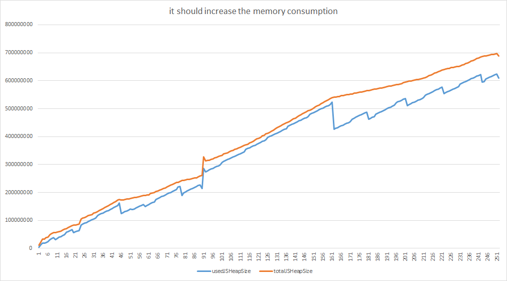
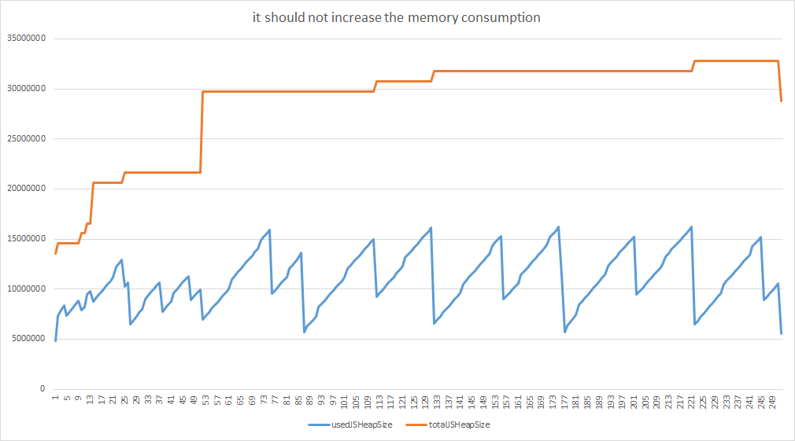

# HTML5 Protractor Tools Documentation - Memory Utils

In order to be able to use all methods this module offers, Google Chrome needs to be started with two additional parameters:

```
> chrome.exe --enable-precise-memory-info --js-flags="--expose-gc"
```

Omit the ".exe" when running on a non Windows machine.

Chrome provides the following values as part of the `window.performance.memory` object:

* jsHeapSizeLimit
* usedJSHeapSize
* totalJSHeapSize

Since these tests often need to run for a longer period of time (several minutes), the `it` function needs to be called with the optional second `timeout` parameter, since the default timeout for Protractor test cases is something like 30 seconds:

```javascript
it('tests something', function () {
   // Do something in here that can take a long time.
}, 1000000);
```

Memory utils may be used to generate `*.txt` log files and `*.csv` data files. A graph of the memory usage of your app is also generated during the test.
The following two graphs showcase the memory usage of the two example test cases available at [`example/test/e2e/memory.spec`](../example/test/e2e/memory.spec)





## Functions

### `runTestFunction(protractorTestInstance, iterations, testFn[, options])`

Allows to run a defined test function (`testFn`) a number of times (`iterations`) as part of a Protractor test (`protractorTestInstance`), tracking the memory usage after each call. The `testFn` function is called with one parameter: `index` - the current iteration.

The optional `options` object has the following default values:

```javascript
{
    initialPostGcSleep: 2500,
    finalPostTestSleep: 1500,
    finalPostGcSleep: 4500,
    writeLogFile: true,
    writeCsvFile: true,
    generateGraph: true,
    graphWidth: 800,
    graphHeight: 600
}
```

* `initialPostGcSleep`: Timeout in milliseconds after the initial garbage collection.
* `finalPostTestSleep`: Timeout in milliseconds after the final test execution.
* `finalPostGcSleep`: Timeout in milliseconds after the final garbage collection.
* `writeLogFile`: Enable/disable writing memory results to a log file.
* `writeCsvFile`: Enable/disable writing memory results to a CSV file.
* `generateGraph`: Enable/disable generating memory results graph to a PNG file.
* `graphWidth`: Set graph width.
* `graphHeight`: Set graph height.

Example usage:

```javascript
function changeFilterDate(date) {
    var datePicker = element(by.id('myID'));
    datePicker.sendKeys('', protractor.Key.CONTROL, 'a', protractor.Key.NULL, date).sendKeys(protractor.Key.ENTER);
}

it('tests something', function () {
    var year = 1999;

    html5.memory.runTestFunction(this, 100, function() {
        changeFilterDate('08/03/' + year++);
    });
}, 1000000);
```

The above example defines a function that changes a field in the UI, triggering some action, e.g. refreshing a grid. The `runTestFunction` call then executes the `changeFilterDate` function (through an anonymous function) 100 times, incrementing the example date parameter each time. The test results are written to a log file, a CSV file and a graph is generated.

## Low-level Functions

The following functions are used internally, but can also be used from your own code. Most test cases should stick to the above `runTestFunction` API, though.

### `startMemoryMeasurement(protractorTestInstance[, options])`

Convenience function for initializing memory measurement of a given protractor test case. Returns an object with `measureMemory([isLast])` and `callGarbageCollection()` methods like below.

The optional `options` object has the following default values:

```javascript
{
    writeLogFile: true,
    writeCsvFile: true,
    generateGraph: true
}
```

* `writeLogFile`: Enable/disable writing memory results to a log file.
* `writeCsvFile`: Enable/disable writing memory results to a CSV file.
* `generateGraph`: Enable/disable generating memory results graph to a PNG file.

By default, the results are written to a log file (in textual form, comparing each call with the previous one), to a CSV file (raw numbers, great for analysis in something like Excel) and a graph is also generated in a PNG file. The name of the file is derived from the test case's description and the current timestamp.

Example usage:

```javascript
it('tests something', function () {
    var memoryMeasure = html5.memory.startMemoryMeasurement(this);
    [...]
     memoryMeasure.callGarbageCollection().then(function () {
        memoryMeasure.measureMemory().then(function(memUsage){
            [...]
        });
        [...]
     });
});
```

### `measureMemory(previousResult, [isLast], [filename], [csvFilename], [options], [graphData])`

Allow measuring of currently used memory. The difference to the previous call will be printed to a log file (`filename`), and the raw values will be written to a CSV file (`csvFilename`).

The optional `isLast` parameter can be used to indicate that this is the final call, and the function will print a different heading above the memory values.

The optional `options` object has the following default values:

```javascript
{
    writeLogFile: true,
    writeCsvFile: true,
    generateGraph: true
}
```

* `writeLogFile`: Enable/disable writing memory results to a log file.
* `writeCsvFile`: Enable/disable writing memory results to a CSV file.
* `generateGraph`: Enable/disable generating memory results graph to a PNG file.

The `graphData` parameter is an array of 2 objects for storing the memory results.

Returns a promise object that (when resolved) has the following attributes:

```javascript
{
    jsHeapSizeLimit,
    usedJSHeapSize,
    totalJSHeapSize
}
```

Example:

```javascript
var promise = html5.memory.measureMemory();
promise.then(function (result) {
    myResult = result;
    console.log(myResult.usedJSHeapSize);
});

// ...

html5.memory.measureMemory(myResult);
```

Works only in Chrome launched with parameter `--enable-precise-memory-info`.


### `callGarbageCollection([filename], [options])`

Suggests to the browser to invoke garbage collection.

Call this before starting and finishing memory measurement, to ensure that the tests are on a clean baseline.

If a filename is specified the results will appended to that file.

The optional `options` object has the following default values:

```javascript
{
    writeLogFile: true
}
```

* `writeLogFile`: Enable/disable writing memory results to a log file.

Works only in Chrome launched with parameter `--js-flags="--expose-gc"`, as by default garbage collection triggering from javascript is not possible.
